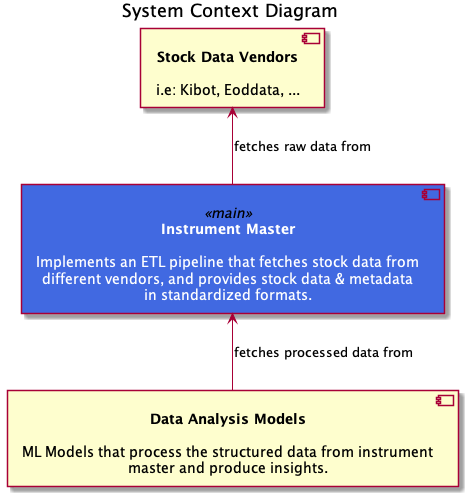
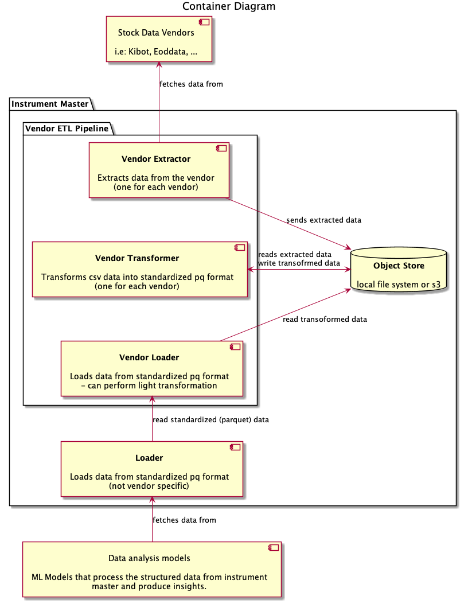
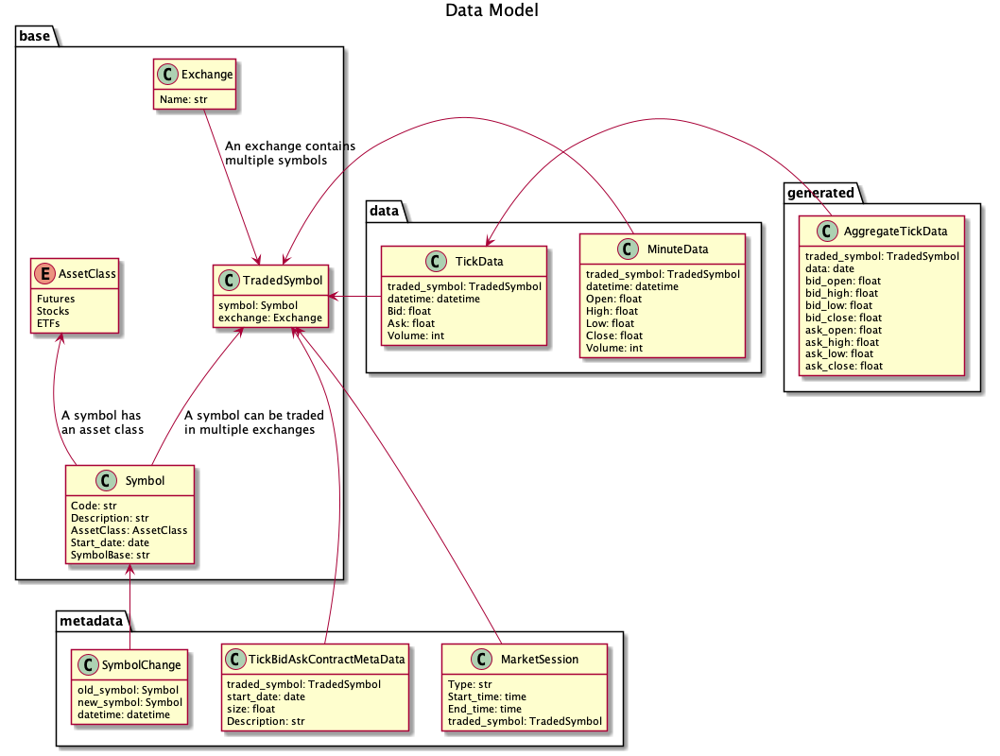

<!--ts-->
   * [Overview](#overview)
   * [Architecture](#architecture)
      * [System context diagram](#system-context-diagram)
      * [Container Diagram](#container-diagram)
         * [Questions](#questions)
         * [Notes](#notes)
   * [Data Model](#data-model)
      * [Notes](#notes-1)
   * [Proposed Code Layout](#proposed-code-layout)
      * [Guidelines](#guidelines)
      * [Questions](#questions-1)


<!--te-->

# Overview

At a high level, we want to implement a system that:

- Downloads the price data (both historical & also real-time) from different
  data sources:
  - We already have Kibot interface
  - We want to add an interface for EODData
- Downloads and saves the related metadata
- Converts CSV price data into a suitable format for fast querying
  - We decided against using Parquet files and use directly a DB backend
- Implements mapping between metadata and price data
- Allows to query the system to get specific price time series based on symbol
  name
  - It should handle:
    - Different frequency (e.g., end-of-day vs 5 minutes vs 1 minute)
    - Different asset classes (e.g., equities vs futures vs forex vs ...)
    - Different providers (e.g., `kibot` vs `eoddata` vs `firstrate` vs ...)
- Has:
  - Different backends for different data providers (e.g., Kibot, EODData)
  - A layer to make all the data uniform from the semantics point of view

# Architecture

Note: The documentation of the architecture follows the C4 model:
https://c4model.com/.

## System context diagram

```plantuml
@startuml
title System Context Diagram

skinparam defaultTextAlignment center
skinparam component {
    backgroundcolor<<main>> RoyalBlue
    FontColor<<main>> white
}

component imaster <<main>> [
**Instrument Master**

Implements an ETL pipeline that
- fetches stock data from different vendors
- provides stock data & metadata in standardized formats.
]

component vendors [
**Stock Data Vendors**

i.e: Kibot, Eoddata, ...
]

component models [
**Data Analysis Models**

ML Models that process the structured data from instrument
master and produce insights.
]

imaster -up-> vendors: fetches raw data from
imaster <-- models: fetches processed data from
@enduml
```


## Container Diagram

```plantuml
@startuml
title Container Diagram

skinparam defaultTextAlignment center

package "Instrument Master" {
   package "Vendor ETL Pipeline" {
      component vextractor [
      **Vendor Extractor**

      Extracts data from the vendor
      (one for each vendor)
      ]

      component vtransformer [
      **Vendor Transformer**

      Transforms csv data into standardized pq format
      (one for each vendor)
      ]

      component vloader [
      **Vendor Loader**

      Loads data from standardized pq format
      - can perform light transformation
      ]

   }

    component loader [
    **Loader**

    Loads data from standardized pq format
    (not vendor specific)
    ]

    database objstore [
    **Object Store**

    local file system or s3
    ]

    vextractor -down-> objstore: sends extracted data
    vtransformer <-right-> objstore: reads extracted data\lwrite transofrmed data
    vloader -up-> objstore: read transoformed data
    loader -up-> vloader: read standardized (parquet) data

    ' styling
    vextractor -[hidden]down- vtransformer
    vtransformer -[hidden]down- vloader

}

component vendors [
Stock Data Vendors

i.e: Kibot, Eoddata, ...
]

component models [
Data analysis models

ML Models that process the structured data from instrument
master and produce insights.
]

vendors <-- vextractor: fetches data from
loader <-up- models: fetches data from
@enduml
```


### Questions

1. How does each stage in the container diagram run? are they all manually
   triggered? this view implies that these stages run independently, which I
   believe is desired, but we could also use a sequence diagram to highlight how
   these should be triggered.

TODO(Amr): Add a sequence diagram later

> GP: We will run the extractor and transformer only once to generate historical
> data.
>
> Later we will implement a real-time processor (e.g., with Airflow) that keeps
> the data updated. The interface of course won't change

### Notes

- I didn't reflect caching in this diagram just yet
- `data` refers to both stock data & metadata in this context
- The vendor loader can do light transformation because we may need to test out
  some transformation steps, and the transformer step is sometimes too costly to
  allow that.

TODO(Amr): think if there's a better way to handle this, perhaps caching could
help mitigate these costier steps, and transformation doesn't need to be a
single step.

# Data Model

```plantuml
@startuml
title Data Model

hide enum methods
hide class methods

namespace base {
   enum AssetClass {
      Futures
      Stocks
      ETFs
   }

   class Exchange {
      Name: str
   }

   class Symbol {
      Code: str
      Description: str
      AssetClass: AssetClass
      Start_date: date
      SymbolBase: str
   }

   class TradedSymbol {
      symbol: Symbol
      exchange: Exchange
   }

   Symbol -up-> AssetClass: A symbol has\lan asset class
   Symbol -up-> TradedSymbol: A symbol can be traded\lin multiple exchanges
   Exchange -down-> TradedSymbol: An exchange contains\lmultiple symbols
}

namespace data {
   class MinuteData {
      traded_symbol: TradedSymbol
      datetime: datetime
      Open: float
      High: float
      Low: float
      Close: float
      Volume: int
   }

   class TickData {
      traded_symbol: TradedSymbol
      datetime: datetime
      Bid: float
      Ask: float
      Volume: int
   }

   MinuteData -left-> base.TradedSymbol
   TickData -left-> base.TradedSymbol

}

namespace metadata {
   class SymbolChange {
      old_symbol: Symbol
      new_symbol: Symbol
      datetime: datetime
   }

   class TickBidAskContractMetaData {
      traded_symbol: TradedSymbol
      start_date: date
      size: float
      Description: str
   }

   class MarketSession {
      Type: str
      Start_time: time
      End_time: time
      traded_symbol: TradedSymbol
   }

   SymbolChange -up-> base.Symbol
   TickBidAskContractMetaData -up-> base.TradedSymbol
   MarketSession -up-> base.TradedSymbol
}

namespace generated {
   class AggregateTickData {
      traded_symbol: TradedSymbol
      data: date
      bid_open: float
      bid_high: float
      bid_low: float
      bid_close: float
      ask_open: float
      ask_high: float
      ask_low: float
      ask_close: float
   }

   AggregateTickData -left-> data.TickData
}
@enduml
```


## Notes

- Generated data should be behind an interface (then it computed on the fly or
  cached somehow).

# Proposed Code Layout

Based on the container diagram, the code layout matches the different containers
that we have.

```ansi
types/  # standardized types (see data model above)
loader/  # adapts all vendor loaders to a common interface
vendors/
   kibot/
      extractor/
      transformer/
      loader/
      types/  # vendor specific types
      config.py  # s3 paths, credentials for vendor
   eoddata/
      extractor/
      transformer/
      loader/
      types/
      config.py
```

## Guidelines

- `extractor` should only download the data, and keep it as close to the
  downloaded structure as possible (ideally not modify it at all.)
- Downloading already downloaded data should be a no-op by default (before
  downloading, check that the file doesn't exist in s3). This behavior should be
  overridable by a command line arg: `--override` (which is the opposite of
  `--incremental`)
- `extractor` & `transformer` share certain types, and s3 paths (where
  `extractor` outputs files and `transformer` picks them up), those would be
  saved in `config.py`
- We should make a distinction between `data` & `metadata` in all of the
  packages.

TODO(Amr): be more specific about how to make that distinction

## Questions

1. For the `extractor` package, should these be individual runnable scripts? or
   should we have a `download all` script/command?

> **GP:** I would do individual scripts, since this for now is a one-off
> operation and we will download data in chunks
>
> I'm also ok with a single script with --dataset to control which subset of the
> data to download / transform

2. Should we have a coverage matrix for which data each vendor fulfills?

> **GP:**: Not urgent
